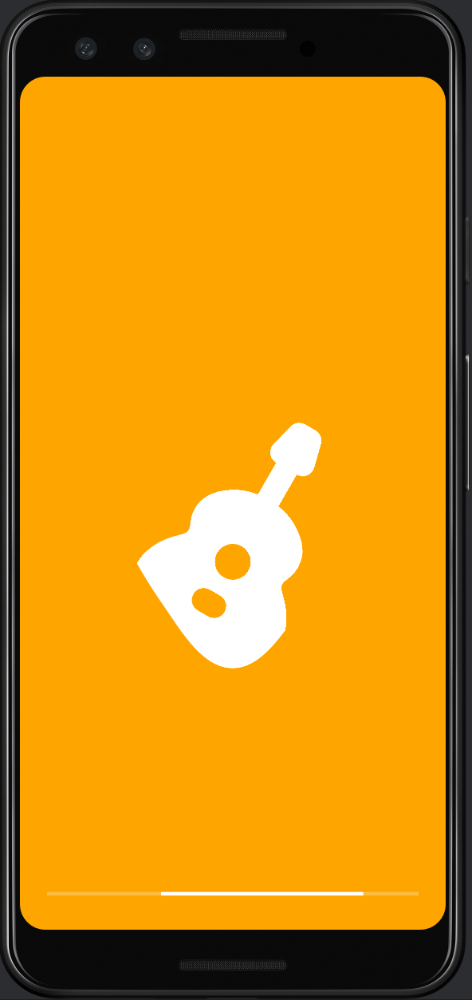

# Guitar Mobile Application
## Project Report
**What:**
Using Android Studio, I created a simplistic guitar application from which to learn.

**How:**
This game comprises three main screens: the home screen, the practice screen, and the profile screen. Each screen has fragments and views, each designed to be modular and flexible.
- The home screen serves allows the user to study the main lessons.
- The practice screen is a basic component. It serves as a central hub of modular practice lessons.
- Finally, the profile screen allows the user to view their days practiced and achievements.

## Mobile Application Screenshots

